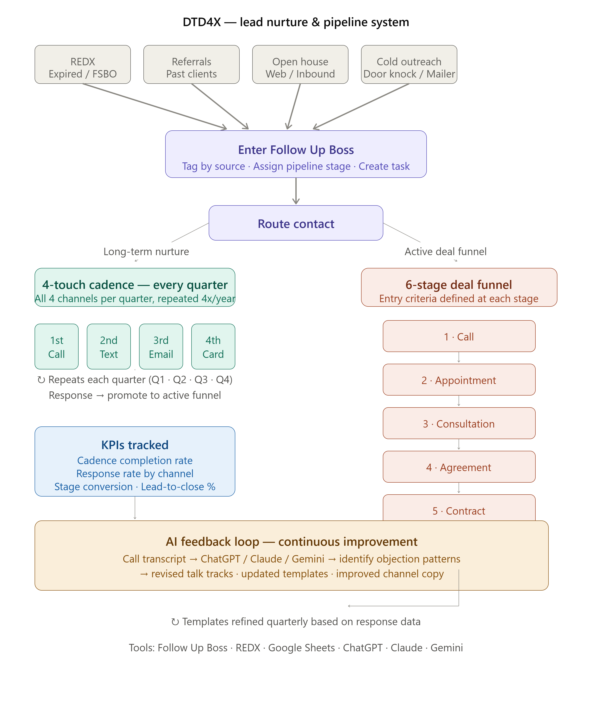

# DTD4X — CRM Lead Nurture & Pipeline System

## What This Project Is

DTD4X stands for **Do The Database 4 Times**.

I built this system because leads and past contacts were going cold due to inconsistent follow-up. Most agents touch a lead once or twice and move on. I designed a CRM-based system where every contact in the database would be touched **four times per year** through a rotating channel cadence — ensuring no lead went cold due to lack of process.

---

## Business Problem

- Leads captured from REDX and other sources were entering Follow Up Boss but not being worked systematically
- Follow-up was inconsistent — dependent on memory and mood rather than process
- No visibility into which channels were converting or where leads were dropping out of the funnel
- No feedback loop to improve scripts and outreach over time

---

## System Architecture

### The 4x Annual Cadence
Every contact receives four touches per year through a rotating channel sequence:

| Quarter | Channel |
|--------|---------|
| Q1 | Phone call |
| Q2 | Text message |
| Q3 | Social media / Email |
| Q4 | Handwritten card |

### Lead Routing
- New leads enter **Follow Up Boss**, tagged by source
- Assigned to a pipeline stage immediately upon entry
- Routed into both **long-term nurture** and the **6-stage deal funnel**

### 6-Stage Deal Funnel

Each stage has defined entry criteria, exit criteria, and a follow-up task attached.

---

## KPIs Tracked

| Metric | Description |
|--------|-------------|
| Cadence completion rate | % of contacts who received all 4 touches in a 12-month period |
| Response rate by channel | Which channel (call, text, email, card) generated the most replies |
| Stage conversion rate | % moving from each stage to the next |
| Lead-to-close % | Overall conversion from database entry to closed deal |
| Pipeline leakage | Where leads were dropping out and why |

---

## AI Feedback Loop

Used **ChatGPT**, **Claude**, and **Gemini** to review call transcripts and improve outreach over time:

1. Call transcript uploaded to AI after each session
2. AI identified objection patterns, weak script moments, and missed opportunities
3. Output: revised talk tracks, improved text templates, updated email copy
4. Templates refined quarterly based on response rate data

This created a continuous improvement loop — each quarter's outreach was better than the last.

---

## Tools Used

- **Follow Up Boss** — CRM, pipeline management, lead routing, task automation
- **REDX** — Lead sourcing (expired listings, FSBOs)
- **Google Sheets** — KPI tracking, cadence completion dashboard
- **ChatGPT / Claude / Gemini** — Call transcript analysis, script refinement, template improvement

---

## Skills This Project Demonstrates

`pipeline management` `lead lifecycle` `CRM workflows` `funnel conversion` `stage conversion` `lead routing` `lead source tracking` `pipeline leakage` `database nurture` `sales operations` `conversion KPIs` `process mapping` `workflow design` `process documentation` `AI-assisted feedback loop` `call transcript analysis` `outreach optimization` `template refinement` `prompt engineering`

---

## How a Company Could Use This

This system is directly transferable to any B2B or B2C sales environment:

- Replace Follow Up Boss with Salesforce, HubSpot, or any CRM
- Replace real estate lead sources with any inbound/outbound lead flow
- The cadence logic, funnel structure, KPI framework, and AI feedback loop apply to any sales or RevOps context

The core capability: **designing a system that makes consistent follow-up automatic, measurable, and improvable over time.**

---

## Project Status

System designed and deployed during active real estate operations. Now documented as a portfolio case study demonstrating RevOps, CRM architecture, and AI-assisted workflow design.
